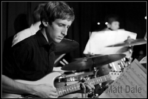

# 1987

EUJO started off as Edinburgh University Dance Band back in 1987, when it was formed by a dedicated group of musicians from the University. After its first year, the name changed to Edinburgh University Big Band, and trumpeter Kenny Coventry was brought in to conduct. During the next few years, the band played numerous concerts across Scotland and England on tour, as well as lending its unique sound to University balls and functions, and playing self-promoted concerts in Edinburgh.

# 1993 / 1994

In 1993, the band changed its name again to the Edinburgh University Jazz Orchestra, and welcomed in a new conductor, Edinburgh trumpeter Eddie Severn. That year saw the band consolidating a new and exciting repertoire, and the first rewards of this were seen in 1994, when the band played two concerts with renowned Scottish saxophonist Tommy Smith, followed by a successful tour of Scotland, including a packed concert at the 13th Note – one of Glasgow’s top jazz clubs. The same year, the band played a series of prestigious concerts at the Edinburgh International Jazz Festival, playing with a string of guest artists including Bruce Adams, Alan Barnes and Andrew Speight. The venues included the party atmosphere of the Ross Theatre, Princes Street Gardens, the hard-core after hours Bluenote jazz club.

# 1995

1995 was another great year for the band, including the traditional Easter tour, this time a five-night jaunt to the north of England. Having completed the traditional self-promoted concerts in University venues in the summer term, the band returned to its festival residency on Saturday nights in the packed Festival Club. The academic year opened with a concert in the growing Dunoon Jazz Festival, and then in November a big-name assignment beckoned; playing with Bobby Shew in Glasgow, at the Scottish Trumpet Society’s inaugural meeting, which saw the band play four numbers with the trumpet wizard for an appreciative audience.

# 1996

After consolidating membership and doing some serious practice, 1996 noted a return to the festival fringe, with seven gigs over a week at the Tron Jazz Cellar, below the Ceilidh House (as it was then called). Full houses and good reviews helped boost the band’s image. The band appeared in the festival again the following year, this time hosted by the University Staff Club for the whole month.
​
# 1997 / 1998

In January 1998, mainly due to financial reasons, Eddie Severn’s services as Musical Director of EUJO were terminated. Dr. Mike Hardy was appointed as a short-term Director, and prepared the band for a concert for Edinburgh District Council at the end of Spring term. In the summer term, the band continued to rehearse, but lacked direction (and a Director!) such that a lot of enthusiasm was lost and several members left.
​

​A small number of members remained determined to re-start EUJO in Autumn term of the 1998/99 session, and through their hard work this happened. A new Musical Director, Dave Prentice, was appointed, and the Society Constitution re-written to clarify the new aims and direction of EUJO. Following this the society brought together new members and an unfamiliar repertoire, creating a fresh start similar to the one EUJO had in 1993. The new band performed to audiences in the Teviot Row House, the Pleasance Cabaret Bar, and ended the year with a fantastic performance at the Queen’s Hall, playing alongside the Big Bang Big Band (directed by Dr. Mike Hardy) and accompanying the Edinburgh University Swing Dance Society.
​
# 2001 / 2002

The year 2001 saw an influx of new players, and a breath of fresh air to EUJO, with President Ewan Armstrong taking the band through a quiet but successful year, during which they played several gigs at the Plesance Cabaret Bar. Richard Bartsch took over as President in 2002, and the band continued playing regular Plesance gigs whilst the new committee worked hard to broaden EUJO‘s horizons. Dave Prentice wrote several arrangements to help increase the repertoire, and after much organisation the band were able to successfully record some of their best tracks in 2003.
​
# 2003

​When Charlie Malcolm took to the helm in 2003 there was another push to play more gigs and do some more recording. Following a ‘Teviot Middle Bar inspirational moment’ this push produced ‘Jazz Idol’; a talent-finding project that culminated in a live grand final in 2004 – a huge success. Clare Williamson became president for the 2004/2005 accademic year, and through hard work and good contacts she took Jazz Idol to a whole new level. The final in January 2005 saw around 600 people pack into the Potterrow Venue to see an amazing show. A very successful year was finshed off with a band holiday in Amsterdam – great fun! Since then the band was awarded the EUSA societies oscar award for Best Event, in recognition of the success of the inaugural Jazz Idol.

# 2007

​The Jazz Idol series (as it became) continued on for another two years, with great gigs again in the Potterrow Venue. But it was time for a change. Introducing Bond Idol 2008. The idea was spawned, as its predecessor, in a Teviot moment, and led to another in a long line of epic Idol events. With 10 new Bond theme songs arranged for the band by players and directors past and present, EUJO took the stage once more.

Following Bond Idol 2008, the 2008 AGM saw radical changes to the constitution of the society. It was decided that for the year 2008/9 EUJO would take the unprecedented step of re-auditioning the entire band, as opposed to merely auditioning for the seats vacated at the end of the previous year. This would ensure the continued improvement of the band’s quality, with the only persons to be exempt from this being the office bearers. EUJO decided it would hold another GM after an audition session to decide on the remaining (i.e. non office bearing) positions for the committee. 

# 2008

Under the presidential leadership of Imran Shahryar, and with the legendary Simon Hendry as musical director, 2008/9 saw another improved year, with that year’s main event being Soul Idol – an epic success. This was followed by EUJO sounding at perhaps its best ever under the presidential/musical leadership of the infamous Marr brothers (Ed/James respectively) in 2009/10. A return to the band’s jazz roots saw an impressive “Jazz Idol 2010″ gig cap off an exciting year. 

# 2010

​2010/11 was a year of notable development for the band under the Presidency of Phil Ouston. The band have actively worked to a further integration within EUSA and have provided services to other societies, such as Swing Dance Soc and Ball Room Dancing Soc. March 2011 saw another huge Idol event, showcasing the best of Michael Jackson in 'Jackson Idol 2011', which again drew in a crowd of over 400 to Potterrow. In addition, Summer 2011 saw EUJO depart on their first concert tour in recent history to Belgium, where the band played to audiences in Brussels, Mechelen and Lier.

# 2011

In 2011/12 Jess Carter took the realm of president, and took the band through Motown Idol 2012 - this was followed in 2013 with Bond Idol Mark 2 - a nostalgic trip for members Matthew Hawke, Ed Marr and Graeme Erskine, who had all played in 2008's Bond Idol.

# 2012

The year of 2012/13 saw pianist Alex Hill take over as musical director and lead the band from strength to strength. As well as continuing to work on old repertoire, new numbers such as Bob Mintzer’s ‘Computer’ and Maynard Ferguson’s ‘Dancing Nitely’ were introduced to give the band a fresh and frequently funky sound.
Successes in this year included a show stopping sell-out gig at the Jazz Bar in November 2012 and the return of Bond Idol in March 2013, conveniently tying in with the release of Skyfall. Idol once again, as tradition dictates, being held in Potterrow.

# 2013

 March 2014 marked a milestone year for EUJO with the premier of its first ever 'Jazz Club Time Machine', a natural follow on from the previous 'Jazz Idols' from before. Hosted again at Potterrow, EUJO succeeded in creating one of the highlights of EUSA's calendar.

# 2015 / 2016

In 2015/16, EUJO was directed by Luke McElroy, while 2016/17 was directed by David 'DJ' Jamieson. Both years were succesful for the band, with some highlights including a perfomance on the Royal Yacht Britania; tours to Paris and Dublin; and two sell out Time Machines (the latter of which was recorded and uploaded to the band's Soundcloud page).
# 2017

2017/8 saw one of the most polished EUJO lineups ever. Under the tutelage of keyboardist, and previous Alto I, Sam Coade (MD) - with the guardianship of Branden Sergent - EUJO performed at one of their largest gigs to date - the Sports Union Ball, an event with a capacity of 2000. Again, Time Machine was a roaring success and another sell-out occasion, and the and had one of its first performances of recent years in McEwan Hall when they were asked to play for the Principle's Leaving Reception. The band toured Munich and formed a close friendship with TUM Big Band, and were helpfully led all over (and under) Munich between gigs.

# 2018

Following the precident set by the preceeding year, Alto I player Gregor Norris took to the helm. Alongside guitarist-turned-president Zach Gilbert, EUJO had successful performances at several society balls, another very high quality Time Machine, and were very happy to host TUM Big Band on their tour to Edinburgh (with a gig at La Belle Angele). Starting a now annual tradition, EUJO took their members on the first Weekend Away trip in semester one, which was followed up by another succesful tour in semester two (this time to Lisbon). Impressed by their performance from the year before, EUJO were invited by the University back to play at McEwan Hall for an end of year celebration.

# 2019

With another saxophonist at the helm, Jack Smith (the previous year's Tenor II) and president Emma Clark took the band to Milngavie for a Weekend Away, over to Madrid for some sun and some jazz, and down to Durham to compete in the Great Nothern Big Band Festival - for which the band were overjoyed to not only place second, but for which the rythm section won the award for best section of the competition. In Madrid the band were central in forming a relationship between Edinburgh University and the Complutense University of Madrid. Again, the band was asked to play in McEwan Hall - this time to celebrate the start of the 'Roaring Twenties'. Preperations were underway to produce Time Machine as a joint venture with the University in McEwan Hall, and for the band to perform as part of Edinburgh's Jazz & Blues Festival, although both of these were unfortuantely postponed due to the COVID-19 pandemic.